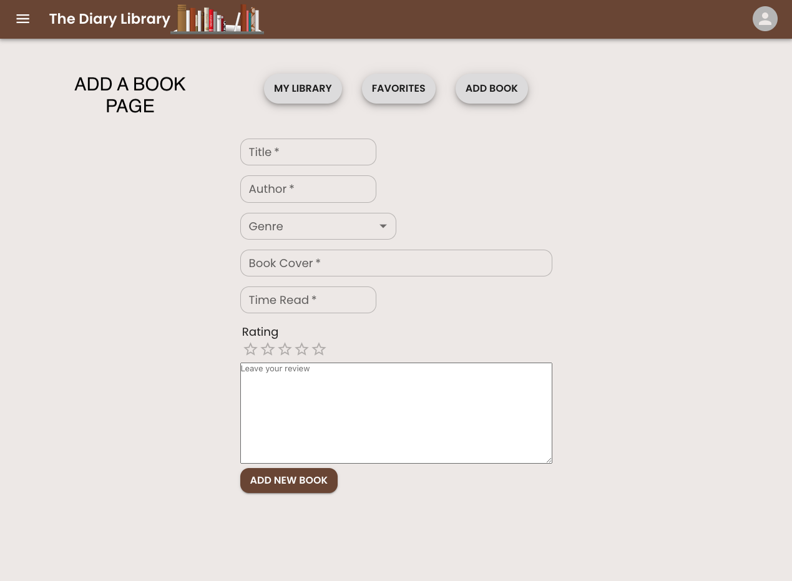

# THE DIARY LIBRARY APP


## Project Description
The Diary Library is a **Full-Stack** multi-pages web application which allows users to log their latest books. 
Other key features include the ability to **register** & **login**. Users are also able select their **favorites** books which are shown on a dedicated page. Users can see the **latest posts** from all users as well.
The back-end was developed using Express in Node.js whilst React was used to build the front-end. The data is stored on a MongoDB database.

## Deployment Link
 [https://the-diary-library-app.netlify.app/welcome/](https://the-diary-library-app.netlify.app/welcome/ "The Diary Library App")

### API Repository Link
 [ https://github.com/thomalex001/ga_project_3_api]( https://github.com/thomalex001/ga_project_3_api/ "The Diary Library API Repository Link")


## Getting Started/Code Installation
Ensure that you have cloned or downloaded both front-end and back-end repositories onto your machine and follow these steps:
1. In the  CLI, run `npm` and then `npm i` on the root level to install dependencies for the backend.
2. In the CLI, open a new tab, and navigate to frontend cd frontend and run the same commands `npm` and `npm i` to install dependencies.
2. Then run the command `npm start` on both terminals.
3. Run the command `npm start` in both tabs to run program in your local environment.


### Dependencies
* MongoDB
* Express
* Jsonwebtoken
* Cloudinary
* MUI (React components library)
* SASS
* Axios 
* CORS 
* Seed.js


## Timeframe 
This project was developed with two of my fellow classmates: [Melanie Sophie Speckens ](https://github.com/elanieca)and [Imogen Farr ](https://github.com/imogen-farr). As a group, we dedicated full day of planning using a detailed wireframe. Constant communication on our Trello board, Zoom and Slack was essential and version control on Git-Hub ensured a linear workflow which simulated a realistic work environment. 

## Technologies Used
* Excalidraw (wireframe)
* HTML/SASS/JavaScript
* React
* Visual Studio Code
* Postman
* Git/GitHub
* Axios packages
* CORS packages
* MUI (React components library)
* Google Fonts
* Zoom
* Slack
* Trello
* MongoDB Cloud (deployment database)
* Netlify (deployment front-end)
* Heroku (deployment back-end)


## Brief/Technical Requirements

- **Build a full-stack application** by making our own backend and front-end
- **Use a Express with Node.js API** using Node.js framework to serve our data from a MongoDB database
- **Consume an API with a separate front-end** built with React
- **Be a complete product** which most likely means multiple relationships and CRUD functionality for at least a couple of models
- **Be deployed online** publicly accessible.

## Planning


* Used Excalidraw to build a wireframe and design the basic layout of the app.
  * The wireframe shows 8 pages, 3 of which are accessible wihout having to login: Welcome, Register, Login as seen above.


  * Once the User is logged in, he has access to: Activity Feed, Book Index, Favorite Books, Book Show and Add A Book pages.
  * A navigation bar is used to navigate between each main pages.

## Build/Code Process

### Developing The API - Day One 

* Excalidraw/Trello
  * Created a wireframe with each pages/components and general flow of our app. This was a crucial part of our project as after completing the wireframe, we were able to write down each of the API requirements for our app. (Alex/Melanie/Imogen)
  * Divided each task for the day on a shared Trello board which allowed us to keep track on our work and ensure we are not blocking each other's work.


* Installation
  * Created a new repository on GitHub. (Melanie)
  * Initial setup of the backend API application by installing the dependencies (Alex/Melanie/Imogen).
    * Express
    * Axios 
    * CORS 
    * Mongoose
    * Nodemon
  * Created a `.gitignore` file and added `“node module”; “.env”; “DS_store”`.
  * Added the boiler plate code below for our API to connect to our database (Melanie)

```javascript
  import express from 'express';
  import Router from './config/router.js';
  import cors from 'cors';
  import { PORT } from './config/environment.js';
  import { connectDb } from './db/helpers.js';

  const app = express();
  app.use(cors());
  app.use(express.json());
  app.use('/api', Router);

  async function startServer() {
    try {
      await connectDb();
      console.log('connected to mongodb');
      app.listen(PORT, () => console.log(`app is listening on port ${PORT}`));
    } catch (err) {
      console.log('ERROR', err);
    }
  }

startServer();
  ```
* Created `UserSchema, BookSchema, GenreSchema` (Melanie, Imogen and Alex respectively)

### Developing the API - Day Two 

* Created `userController, secureRoute, Seeding` tested all functions on Postman (Melanie)

* Created `seed.js`, `bookController` and `Routes` (Imogen)

* Created `genreController` and `Routes`, testing all functions on Postman. Collaborated with Imogen to create the `seed.js` file.


### Developing The React app - Day One

* Installation
  * Created a new repository on GitHub. (Melanie)
  * Initial setup of the frontend application by installing the dependencies (Alex/Melanie/Imogen).
    * Axios 
    * CORS 
    * SASS
    * MUI
  * Created a `.gitignore` file and added `“node module”; “.env”; “DS_store”`.
  * Added the boiler plate code below to connect the front-end to the back-end (Melanie)
```javascript
import axios from 'axios';
import { AUTH } from './auth';

const getHeaders = () => ({
  headers: { Authorization: `Bearer ${AUTH.getToken()}` }
});

const ENDPOINTS = {
  latestBooks: `${process.env.REACT_APP_BASE_URL}/api/books/latest`,
  allBooks: `${process.env.REACT_APP_BASE_URL}/api/books`,
  allGenreNames: `${process.env.REACT_APP_BASE_URL}/api/genres/names`,
  login: `${process.env.REACT_APP_BASE_URL}/api/login`,
  register: `${process.env.REACT_APP_BASE_URL}/api/register`,
  cloudinary: `https://api.cloudinary.com/v1_1/${process.env.REACT_APP_CLOUDINARY_CLOUD_NAME}/image/upload`,
  singleBook: (id) => `${process.env.REACT_APP_BASE_URL}/api/books/${id}`,
  singleGenre: (id) => `${process.env.REACT_APP_BASE_URL}/api/genres/${id}/books`,
  search: (query) => `${process.env.REACT_APP_BASE_URL}/api/books/search?q=${query}`,
  userBooks: (id) => `${process.env.REACT_APP_BASE_URL}/api/users/${id}/books`,
  userFavoriteBooks: (id) => `${process.env.REACT_APP_BASE_URL}/api/users/${id}/favorite-books`
};

const GET = (endpoint) => axios.get(endpoint);
const POST = (endpoint, body, headers) =>
  headers ? axios.post(endpoint, body, headers) : axios.post(endpoint, body);
const PUT = (endpoint, body, headers) => axios.put(endpoint, body, headers);
const DELETE = (endpoint, headers) => axios.delete(endpoint, headers);

export const API = { GET, POST, PUT, DELETE, ENDPOINTS, getHeaders };
```

### Developing The React app - Day Two

* Created the `NavBar` and `Drawer` which allows the user to navigate between the main pages. (Melanie)


* Created a MUI theme which is a great feature that allows a light/dark mode when changing your settings on your machine. (Melanie)

* Created `BookIndex`, `BookShow` and `BookCard` pages. (Imogen)


* In the the image below, we can see the Homepage which shows the `LatestPosts` from all users. 


* Created `Users Dashboard` which contains 3 pages. (Alex)
  * `My Library` shows a list of all the books the User has added on the app
  * `Favorites` shows a list of all the books the User selected as "Favorite" from the `Index` page.
  * `AddBook` allows the User to add a new entry, all fields must be completed in order to save the book to the database.




### Developing The React app - Day Three

* Created a refresh button for `LatestPosts`. (Melanie)
* Added responsive design for mobile, see picture below. (Melanie)


* Created `AddRemoveFavorite` function. (Imogen)
* Created `usersFavoriteBooks` page. (Alex)


## Challenges
* The process of planning our back-end app was challenging as we had to think ahead on which features we will want to have in our app. Once we made those decisions it was easier for us to give ourselves a timeline as we expected to start working on our front-end on day 3.

## Wins
* This was our first project involving a full-stack application and it was really fun being able to build something of our own making with a lot of creative freedom. Great teamwork was essential amd we were supporting each other when we had challenges.

## Key Learning/Takeways
* Extensive planning and communication 
* Building of a full-stack app for the first time
* Use of MUI (React components library) for the first time 

## Bugs
* Some of the images in the `BookCard` are not showing with the right format which can be due to some CSS rules. 

## Future Improvements
* We would have like to find the time to show the avatar of User logged in on the `Navbar` and `Register` page, 

## THANKS FOR READING!

